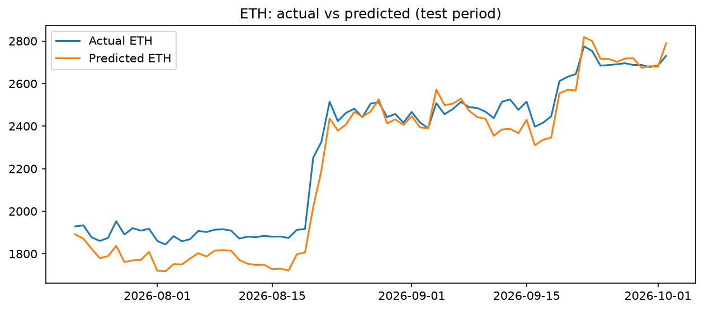
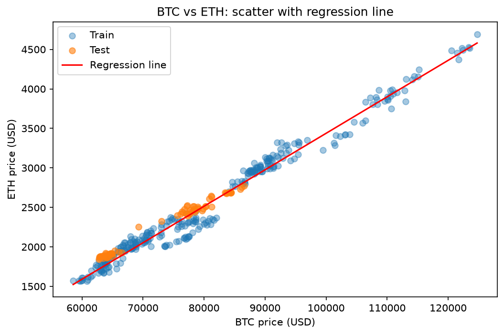

# Crypto Price Regression: BTC vs ETH

Simple linear regression to model Ethereum price from Bitcoin price,
using 1 year of daily data fetched from the CoinGecko API.

## Approach
- **Data:** CoinGecko API, daily USD prices for the last 365 days
- **Split:** time-based 80/20 (no random split, to avoid data leakage)
- **Model A:** ETH price ~ BTC price
- **Model B (baseline):** ETH price ~ time (days)
- **Model C:** ETH daily return ~ BTC daily return

## Results
| Model | Test R2 | Test MAE |
|---|---|---|
| A: BTC -> ETH (price) | 0.923 | $75.6 |
| B: days -> ETH (baseline) | -13.40 | $1137.8 |
| C: BTC return -> ETH return | 0.749 | - |

## Key learnings
- BTC price explains most of ETH price (test R2 0.92), while a time-only baseline fails badly (negative R2) because the trend does not continue into the test period.
- The relationship also holds on daily returns (test R2 0.75, beta 1.30): ETH moves about 1.3% for every 1% BTC move.
- Train R2 is higher than test R2 in all cases, as expected with a time-based split.

## Limitations
- Same-day relationship, not a forecast of future prices
- One feature, one year of data, short test window
- Crypto relationships change over time
- Not financial advice

## How to run
1. `python -m venv venv` and activate it
2. `pip install -r requirements.txt`
3. Create a `.env` file with `COINGECKO_API_KEY=your_key`
4. `python src/fetch_data.py`
5. Open `notebooks/analysis.ipynb` and run all cells

## Tools
Python, pandas, scikit-learn, matplotlib. Built with AI assistance for code, with the analysis, debugging and validation done by me.